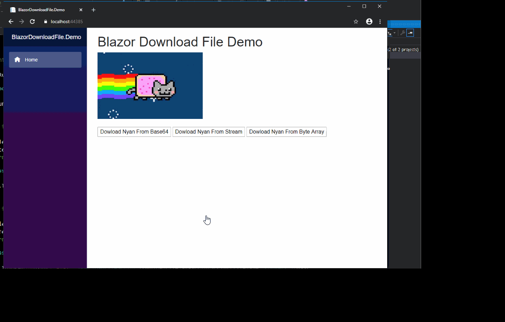

# BlazorDownloadFile

Blazor download files to the browser from c# without any JavaScript library or dependency.

## Installation

`Install-Package BlazorDownloadFile -Version 1.0.10`

## Register the service in your services method

`services.AddBlazorDownloadFile();`

## No javascript library reference dependency

Since version 1.0.6. 

Please updgrade to latest version if you are using older versions.

## Usage

`[Inject] IBlazorDownloadFileService BlazorDownloadFileService { get; set; }`

### BlazorDownloadFileService Methods

<table>
	<tr>
		<th>BlazorDownloadFileService</th>
		<th>Method</th>
	</tr>
	<tr>
		<td>Download File From Base 64 string</td>
		<td>BlazorDownloadFileService.DownloadFile(string fileName, string bytesBase64, string contentType = "application/octet-stream")</td>
	</tr>
	<tr>
		<td>Download File From Byte Array</td>
		<td>BlazorDownloadFileService.DownloadFile(string fileName, byte[] bytes, string contentType = "application/octet-stream")</td>
	</tr>
	<tr>
		<td>Download File From Stream</td>
		<td>BlazorDownloadFileService.DownloadFile(string fileName, Stream stream, string contentType = "application/octet-stream")</td>
	</tr>
	<tr>
		<td>Download File From Text</td>
		<td>BlazorDownloadFileService.DownloadFileFromText(string fileName, string plainText, string contentType = "text/plain")</td>
	</tr>
</table>

## License
MIT
